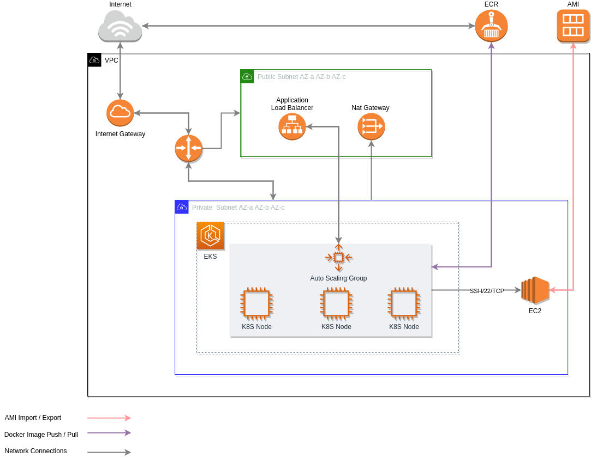

# Backbase
Backbase assignment project.

## Understandment

- Create an scalabe Kubernetes deploy of a given tomcat. Setup ingress and autoscale.
- Create an EC2 instance using terraform, the EC2 must be able to query Google, using curl.

# Execution Plan

- Generate an K8S cluster to deploy the tomcat application.
- Deploy Tomcat 8 app using provided resources.
- Create ingress for tomcat service.
- Open application to be queried externally ( this will also include VPC changes to allow ingress connection). Use Port 8080
- Scale solution accordingly - [here] (https://kubernetes.io/docs/tasks/run-application/horizontal-pod-autoscale-walkthrough/) 
- Use multiple AZs

# Getting Started

- Create a environment var file:
`cat > aws_export.env <<EOF
export region="<YOUR_REGION>"
export access_key="<YOUR_ACCESS_KEY>"
export secret_key="<YOUR_SECRET_KEY>"
export account_id="<YOUR_ACCOUNT_ID>"
EOF
`

# Deploy application

# Tomcat 8 - K8S

# Terraform provision cluster

# Packer Image Builder

# Improvements ( To Do )

- At the moment Packer is handling the build of images `in loco` since **AWS Image Builder** needs to be supported as Terraform provider.
  https://github.com/terraform-providers/terraform-provider-aws/issues/11084

- For this project it wasn't deployed any sidecars for aplication logging.

 
